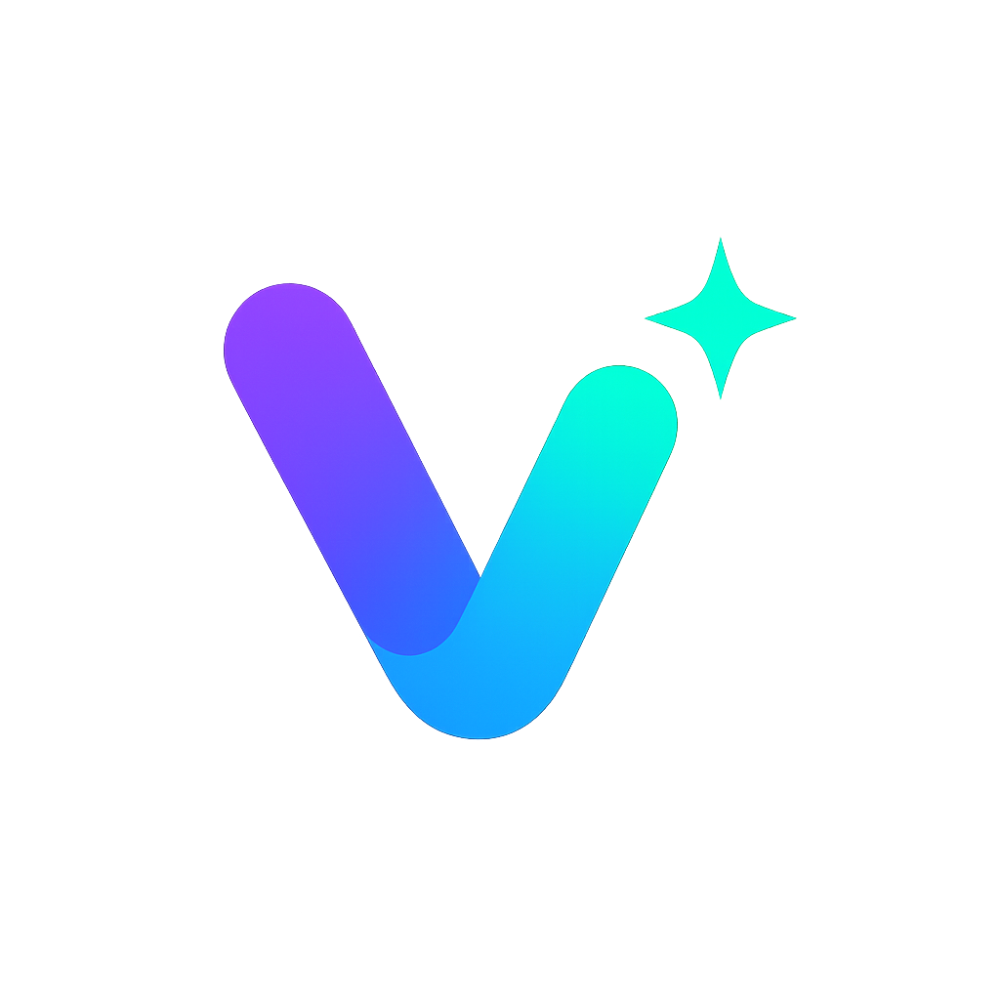

<p align="center">
  
</p>

<h1 align="center">Vibable</h1>

<p align="center">
  <strong>AI에게 넘기기 전, 먼저 생각을 정리하세요.</strong><br />
  <em>Plan it before you prompt it.</em>
</p>

<p align="center">
  <a href="LICENSE"></a>
</p>

<br />

<!-- TODO: insert screenshot -->

---

## 왜 Vibable인가?

AI 코딩 도구는 강력하지만, 지시가 모호하면 엉뚱한 결과물을 내놓습니다. 대부분의 시행착오는 코드에서 생기는 게 아니라 **기획이 흐릿한 채로 프롬프트를 보내는 순간** 시작됩니다.

Vibable은 그 전 단계를 돕는 도구입니다. 무엇을 만들지, 누구를 위해 만들지, 어떤 화면이 필요한지를 체계적으로 정리하고 나서 AI에게 넘기면 — 첫 번째 결과물부터 훨씬 가까운 곳에서 시작할 수 있습니다.

> 복잡한 앱을 혼자 기획하거나, Claude Subagent · OpenClaw 같은 AI 에이전트를 설계할 때 모두 사용할 수 있습니다.

---

## 어떻게 작동하나요?

Vibable은 프로젝트를 **7단계 페이즈**로 구성합니다. 처음부터 끝까지 순서대로 채울 수도 있고, 필요한 페이즈만 골라 쓸 수도 있습니다.

### 앱 기획 트랙 (웹 · 모바일 · CLI)

| # | 페이즈 | 여기서 정리하는 것 |
|---|--------|-------------------|
| 1 | **기획 개요** | 이 프로젝트가 왜 필요한가? 누구를 위한가? 성공 기준은? |
| 2 | **유저 시나리오** | 실제 사용자는 어떤 상황에서 이 앱을 쓰는가? |
| 3 | **요구사항** | 반드시 있어야 할 기능과 있으면 좋은 기능을 구분 |
| 4 | **정보 구조** | 전체 화면 목록과 유저가 이동하는 동선 설계 |
| 5 | **화면 설계** | 각 화면의 목적, 목업 스케치, 상태별 UI |
| 6 | **데이터 모델** | 앱에 필요한 데이터와 그 관계 |
| 7 | **디자인 시스템** | 색상, 타이포, 컴포넌트 스타일 가이드 |

### AI 에이전트 트랙 (Claude Subagent · OpenClaw)

AI 에이전트를 직접 설계할 때 사용합니다. 에이전트가 어떤 역할을 맡고, 어떤 도구를 쓰며, 어떤 상황에서 사람이 개입해야 하는지까지 단계별로 정리합니다.

---

## 주요 기능

**실시간 미리보기**
기획서를 채우는 동시에 오른쪽 패널에서 다이어그램과 목업이 그려집니다. 화면 구조는 자동으로 사이트맵 트리와 유저 플로우 다이어그램으로 시각화됩니다.

**스케치 목업**
화면 설계 단계에서는 손그림 스타일의 와이어프레임 캔버스를 사용합니다. 모바일 · 태블릿 · 데스크톱 뷰를 각각 설계할 수 있고, 로딩 · 오프라인 · 에러 상태도 별도로 정의할 수 있습니다.

**정보 구조 품질 진단**
화면 구조를 채우면 Vibable이 자동으로 연결 오류, 목적 미입력, 도달 불가능한 단계 등 14가지 항목을 검사하고 품질 점수(0–100)를 보여줍니다.

**다양한 내보내기**
완성된 기획서는 JSON, PDF, Markdown, 또는 에이전트 바로 쓸 수 있는 ZIP 번들로 내보낼 수 있습니다.

**서버가 필요 없습니다**
모든 데이터는 브라우저에만 저장됩니다. 계정도, 인터넷 연결도 필요 없고, 오프라인에서도 그대로 동작합니다.

**URL 공유**
기획서를 링크 하나로 공유할 수 있습니다. 링크를 열면 상대방은 내용을 바로 볼 수 있습니다 (읽기 전용).

---

## 내보내기 옵션

| 형식 | 설명 | 사용 대상 |
|------|------|-----------|
| **JSON** | 전체 또는 현재 페이즈 데이터 | 백업, 다른 프로젝트에 재활용 |
| **PDF** | 전체 기획서를 보기 좋게 출력 | 팀 공유, 발표 |
| **Markdown** | 페이즈별 문서 | AI 프롬프트, 노션 등에 붙여넣기 |
| **DESIGN.md** | 디자인 시스템 가이드 문서 | 개발자 핸드오프 |
| **Claude Agent ZIP** | `.claude/agents/` 에 바로 쓸 수 있는 파일 묶음 | Claude Subagent 배포 |
| **OpenClaw ZIP** | SOUL · IDENTITY · TOOLS 등 워크스페이스 파일 묶음 | OpenClaw 배포 |

---

## 시작하기

### 설치

```bash
git clone https://github.com/NGA-TC-Team/vibable.git
cd vibable
pnpm install
bun run dev
```

브라우저에서 `http://localhost:3000`을 열면 바로 사용할 수 있습니다.

### 처음 사용한다면

1. **워크스페이스**에서 "새 프로젝트" 버튼을 눌러 프로젝트를 만드세요.
2. 프로젝트 유형을 선택합니다 — 웹 앱, 모바일 앱, CLI, 또는 AI 에이전트.
3. 1페이즈부터 순서대로 채우거나, 이미 생각해둔 페이즈부터 시작하세요.
4. 오른쪽 미리보기 패널에서 내용이 어떻게 구조화되는지 실시간으로 확인하세요.
5. 다 됐으면 상단 내보내기 버튼으로 원하는 형식으로 받으세요.

---

## 기여하기

버그 리포트, 기능 제안, PR 모두 환영합니다.

1. 먼저 이슈를 열어 변경 사항을 논의해 주세요.
2. 순수 함수와 유틸에는 Vitest 테스트를 함께 작성해 주세요.
3. 함수형 스타일을 유지합니다 — 클래스 컴포넌트, 명령형 패턴은 사용하지 않습니다.

---

## 라이선스

[MIT](LICENSE) © 2026 Vibable Contributors
